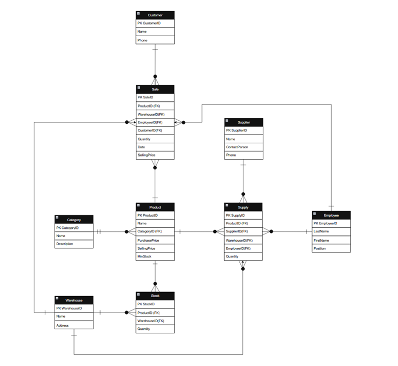

# Лабораторна робота 1: Збір вимог та розробка схеми ER

**Дисципліна:** Організація баз даних

**Виконав:** студент групи ІО-46, Кучерук М.В. (Номер у списку: 05)

**Перевірив:** Русінов В.В.

## Цілі
* Зрозуміти важливість збору та аналізу вимог у проектуванні баз даних.
* Отримати практичний досвід інтерв'ювання зацікавлених сторін та документування функціональних вимог і вимог до даних.
* Навчитись ідентифікувати сутності, атрибути та зв'язки з вимог (знаходження ядер або іменників).
* Створити концептуальну ER-діаграму, яка моделює вимоги до даних.
* Підготуватись до наступних лабораторних робіт: реалізація моделі у вигляді таблиць PostgreSQL, написання SQL-запитів (OLTP/OLAP) та застосування нормалізації та міграцій.

## Хід роботи

### 1. Склад групи та інтерв'ю
**Зацікавлена сторона (клієнт):**
* **Ім'я:** Ірина Ковальчук
* **Роль:** Відповідає на запитання, пояснює, які дані потрібні для його системи.

**Аналітики (збирають вимоги та проєктують модель):**
* Андрій Мельник
* Олена Шевченко
* Анна Коваленко

**Збір вимог (зі слів клієнта):**
Компанія займається роздрібною та дрібнооптовою торгівлею комплектуючими для комп'ютерів. Асортимент налічує близько 500 позицій і постійно зростає. Раніше облік вівся у Excel, але це призвело до низки проблем: важко відстежити реальну наявність товару, губиться інформація про постачальників, немає чіткого розуміння розподілу між двома складами, а також виникають складнощі з фіксацією нових партій.

**Основні побажання до системи:**
* **Товари:** Повна інформація про кожен товар — назва, категорія, ціна закупівлі, ціна продажу.
* **Залишки на складах:** Знати кількість одиниць конкретного товару на кожному з двох складів. Система повинна сигналізувати про мінімальний залишок.
* **Постачальники:** Знати, від кого отримується товар, враховуючи, що один товар можуть возити різні постачальники за різними цінами.
* **Надходження товару:** Фіксувати: який товар, скільки одиниць, від якого постачальника, за якою ціною закупівлі, на який склад поклали.
* **Відвантаження/продажі:** Списувати товар зі складу при продажу, фіксувати дату продажу та кількість.
* **Співробітники:** Розуміти, хто з менеджерів приймав товар на склад або оформлював продаж.
* **Обмеження:** Один товар може зберігатися на обох складах одночасно (розподіл великих партій).

### 2. ER Діаграма

 

**Рисунок 1.** Концептуальна ER-діаграма бази даних.

### 3. Сутності та їх атрибути

**1. Сутність "Товар" (Product)**
| Атрибут | Приклад значення | Пояснення |
|---|---|---|
| ТоварID | 1001 | Унікальний номер товару в системі |
| Назва товару | "Процесор Intel Core i5-12400F" | Як товар називається |
| Категорія | "Процесори" | До якої групи належить |
| Ціна закупівлі | 4500 грн | Скільки ми заплатили постачальнику |
| Ціна продажу | 5700 грн | За скільки продаємо клієнту |
| Мінімальний залишок | 5 шт | Коли варто замовити нову партію |

**2. Сутність "Склад" (Warehouse)**
| Атрибут | Приклад значення | Пояснення |
|---|---|---|
| СкладID | 1 | Унікальний номер складу |
| Назва складу | "Основний склад" | Як називається |
| Адреса | "вул. Київська, 15" | Де знаходиться |

**3. Сутність "Залишок" (Stock) — зв'язкова**
| Атрибут | Приклад значення | Пояснення |
|---|---|---|
| ЗалишокID | 5001 | Унікальний номер запису |
| ТоварID | 1001 | Посилання на товар |
| СкладID | 1 | Посилання на склад |
| Кількість | 23 шт | Скільки одиниць зараз є |

**4. Сутність "Постачальник" (Supplier)**
| Атрибут | Приклад значення | Пояснення |
|---|---|---|
| ПостачальникID | 301 | Унікальний номер постачальника |
| Назва компанії | "ТОВ ТехноПоставка" | Як називається фірма |
| Контактна особа | "Петренко Іван" | З ким спілкуватись |
| Телефон | "+380xxxxxxxxx" | Номер для зв'язку |

**5. Сутність "Співробітник" (Employee)**
| Атрибут | Приклад значення | Пояснення |
|---|---|---|
| СпівробітникID | 4 | Унікальний номер співробітника |
| Прізвище | "Коваленко" | Прізвище |
| Ім'я | "Анна" | Ім'я |
| Посада | "Комірник" | Хто працює |

**6. Сутність "Надходження" (Supply)**
| Атрибут | Приклад значення | Пояснення |
|---|---|---|
| НадходженняID | 201 | Унікальний номер приходу |
| ТоварID | 1001 | Який товар прийшли |
| Кількість | 50 шт | Скільки прийшли |
| ПостачальникID | 301 | Від кого прийшли |
| СкладID | 1 | На який склад поклали |
| СпівробітникID | 4 | Хто приймав |
| Дата | "3-12-2026" | Коли прийшли |

**7. Сутність "Продаж" (Sale)**
| Атрибут | Приклад значення | Пояснення |
|---|---|---|
| ПродажID | 401 | Унікальний номер продажу |
| ТоварID | 1001 | Який товар продали |
| Кількість | 2 шт | Скільки продали |
| СкладID | 1 | З якого складу взяли |
| СпівробітникID | 4 | Хто продавав |
| Дата | "2026-03-12" | Коли продали |

**8. Сутність "Клієнт" (Customer)**
| Атрибут | Приклад значення | Пояснення |
|---|---|---|
| КлієнтID | 701 | Унікальний номер клієнта |
| Прізвище/Назва | "ФОП Шевченко" | Хто купує |
| Телефон | "+380xxxxxxxxx" | Для зв'язку |

### 4. Таблиця зв'язків для ER-діаграми
| Що з'єднуємо (А → Б) | Закінчення біля А (Довідник) | Закінчення біля Б (Операція/Залишок) | Пояснення |
|---|---|---|---|
| Category → Product | One (and only one) | Zero or many | У одній категорії може бути багато товарів або жодного. |
| Product → Stock | One | Zero or many | Товар може мати залишки на різних складах. |
| Warehouse → Stock | One | Zero or many | На складі лежить багато різних товарів. |
| Supplier → Supply | One | Zero or many | Один постачальник може зробити багато поставок. |
| Product → Supply | One | Zero or many | Один і той самий товар може приїжджати різними партіями. |
| Warehouse → Supply | One | Zero or many | Багато поставок можуть приїжджати на один склад. |
| Employee → Supply | One | Zero or many | Один співробітник може прийняти багато поставок. |
| Customer → Sale | One | Zero or many | Один клієнт може купувати у нас багато разів. |
| Product → Sale | One | Zero or many | Один вид товару може бути проданий багато разів. |
| Warehouse → Sale | One | Zero or many | Продажі можуть здійснюватися з конкретного складу. |
| Employee → Sale | One | Zero or many | Один менеджер може оформити багато продажів. |

### 5. Припущення та обмеження (Assumptions and Constraints)
1. **Один товар — одна категорія:** Кожен товар може належати лише до однієї категорії одночасно.
2. **Розподіл по складах:** Один і той самий товар може зберігатися на обох складах одночасно, але з різною кількістю.
3. **Унікальність артикулів:** Передбачається, що кожен товар має унікальний ProductID, який не повторюється навіть для схожих моделей.
4. **Фіксація цін:** Ціна закупівлі в операції Supply та ціна продажу в Sale фіксуються в момент проведення операції. Це дозволяє зберігати історію, навіть якщо ціна в основній картці товару зміниться пізніше.
5. **Атомарність операцій:** Один запис у таблиці Supply або Sale відповідає продажу/приходу одного конкретного виду товару. Якщо клієнт купує три різні товари, це фіксується як три окремі операції (або записи).
6. **Контроль залишків:** Мінімальний залишок (MinStock) є глобальним показником для товару в усій мережі, а не для кожного складу окремо.
7. **Незмінність історії:** Видалення співробітника або клієнта з бази не призводить до видалення історії операцій, які вони здійснювали (цілісність даних).

## Висновок
У ході виконання лабораторної роботи було спроєктовано інфологічну модель (ER-діаграму) для автоматизації складського обліку компанії з продажу електроніки. Створена модель вирішує ключові проблеми клієнта: забезпечує роздільний облік товарів на двох складах, дозволяє контролювати мінімальні залишки та зберігає повну історію взаємодії з постачальниками й клієнтами.
