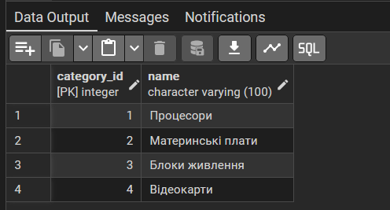
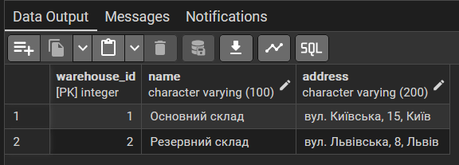
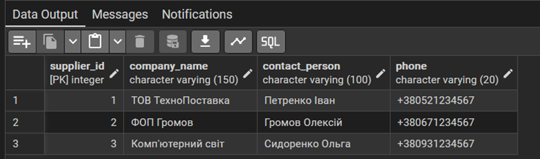
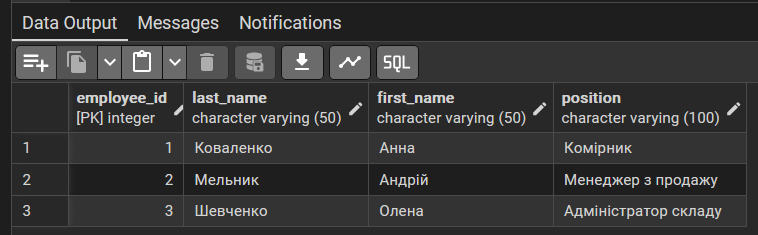
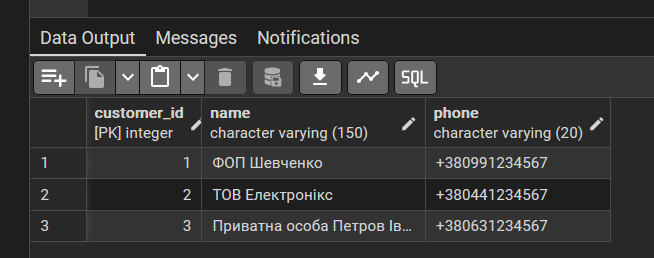
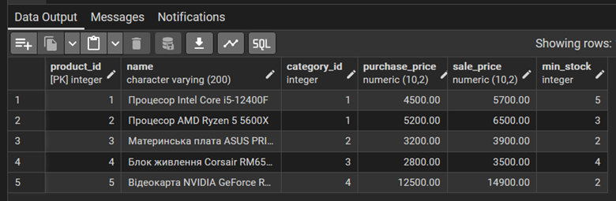
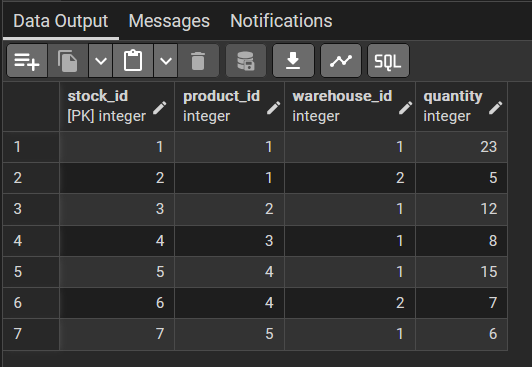
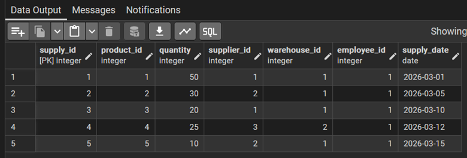
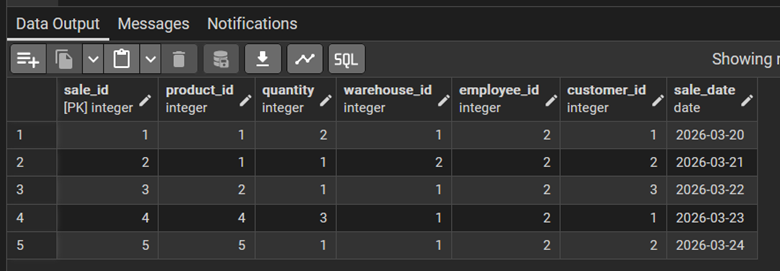

# Лабораторна робота № 2: Перетворення ER-діаграми на схему PostgreSQL

**Дисципліна:** Організація баз даних

**Виконав:** студент групи ІО-46, Кучерук М.В. (Номер у списку: 05)

**Перевірив:** Русінов В.В.

## Цілі
* Написати SQL DDL-інструкції для створення кожної таблиці з ERD в PostgreSQL.
* Вказати відповідні типи даних для кожного стовпця, вибрати первинний ключ для кожної таблиці та визначити зовнішні ключі, обмеження UNIQUE, NOT NULL, CHECK або DEFAULT.
* Вставити зразки рядків (принаймні 3–5 рядків на таблицю) за допомогою INSERT INTO.
* Протестувати все в pgAdmin.

## Хід роботи
Спроєктована реляційна схема складається з 9 таблиць. Повний код для створення бази даних та заповнення її тестовими даними знаходиться у файлі `lab_2.sql` у цьому репозиторії.

### Довідкові таблиці (незалежні):
* **category (Категорії):** Класифікатор товарів. Стовпець `category_id` є первинним ключем. Атрибут `name` (назва категорії) має тип `VARCHAR(100)` та обмеження `NOT NULL` і `UNIQUE`. Це гарантує, що в базі неможливо випадково створити дві категорії з однаковою назвою (наприклад, двічі додати «Процесори»).
* **warehouse (Склади):** Зберігає інформацію про фізичні місця зберігання товару. Ключ — `warehouse_id`. Атрибути `name` та `address` мають обмеження `NOT NULL`, оскільки для складського обліку критично важливо точно ідентифікувати локацію.
* **supplier (Постачальники):** База контрагентів, від яких компанія отримує товар. Ключ — `supplier_id`. Поля `company_name` та `phone` є обов'язковими (`NOT NULL`), щоб завжди мати змогу зв'язатися з постачальником у разі питань щодо партії товару.
* **employee (Співробітники):** Список персоналу магазину/складу. Ключ — `employee_id`. Атрибути `last_name` та `first_name` є `NOT NULL`. Ця таблиця необхідна для персоніфікації відповідальності: щоб завжди знати, який саме менеджер чи комірник оформив конкретне надходження або продаж.
* **customer (Клієнти):** База покупців (фізичних осіб або компаній). Ключ — `customer_id`. Поле `name` є обов'язковим (`NOT NULL`), а телефон — опціональним. Таблиця дозволяє вести історію покупок для кожного клієнта.

### Основні та залежні таблиці (операційні):
* **product (Товари):** `product_id` (PK). Містить зовнішній ключ `category_id`, що посилається на `category`. Встановлено обмеження `CHECK` для перевірки того, що ціна закупівлі більша за нуль, ціна продажу не менша за ціну закупівлі, а мінімальний залишок не є від'ємним.
* **stock (Залишки на складах):** `stock_id` (PK). Реалізує зв'язок "багато до багатьох" між товарами та складами. Містить зовнішні ключі `product_id` та `warehouse_id`. Додано складене обмеження `UNIQUE (product_id, warehouse_id)`, щоб уникнути дублювання одного й того ж товару на одному складі.
* **supply (Надходження):** `supply_id` (PK). Фіксує операцію приходу товару. Містить зовнішні ключі на таблиці `product`, `supplier`, `warehouse` та `employee`. Кількість товару контролюється через `CHECK (quantity > 0)`.
* **sale (Продажі):** `sale_id` (PK). Фіксує операцію відвантаження. Містить зовнішні ключі на `product`, `warehouse`, `employee` та `customer`. Стовпець `customer_id` може бути NULL, якщо клієнт не захотів залишати свої дані. Кількість товару контролюється через `CHECK (quantity > 0)`.

## Результати виконання
Створені таблиці успішно заповнено тестовими даними. Для перевірки коректності було виконано тестові SQL-запити.

Рисунок 1. Результат виконання запиту SELECT * FROM category;. Відображає успішно заповнений довідник із 4 категорій товарів (процесори, материнські плати тощо).

Рисунок 2. Результат виконання запиту SELECT * FROM warehouse;. Демонструє записи двох складів (Основний та Резервний) із вказаними локаціями .

Рисунок 3. Результат виконання запиту SELECT * FROM supplier;. Показує 3 доданих постачальників товарів разом із контактними даними .

Рисунок 4. Результат виконання запиту SELECT * FROM employee;. Містить перелік із 3 співробітників компанії із зазначенням їхніх посад (комірник, менеджер та адміністратор) .

Рисунок 5. Результат виконання запиту SELECT * FROM customer;. Демонструє 3 зареєстрованих клієнтів (як фізичних осіб, так і компанії) з номерами телефонів .

Рисунок 6. Результат виконання запиту SELECT * FROM product;. Виводить 5 товарних позицій із зазначенням цін закупівлі/продажу, мінімального залишку та прив'язкою до категорій через category_id .

Рисунок 7. Результат виконання запиту SELECT * FROM stock;. Відображає розподіл товарів по різних складах (7 записів), що підтверджує коректну роботу зв'язку "багато до багатьох" та обмеження унікальності .

Рисунок 8. Результат виконання запиту SELECT * FROM supply;. Показує 5 успішних транзакцій надходження товару від постачальників на склади компанії .

Рисунок 9. Результат виконання запиту SELECT * FROM sale;. Відображає 5 операцій продажу товарів клієнтам із фіксацією дати, кількості, складу та відповідального співробітника.

## Висновок
У ході виконання лабораторної роботи було успішно здійснено перехід від концептуальної інфологічної моделі (ER-діаграми) до фізичної реляційної схеми бази даних у СУБД PostgreSQL.

На практиці було засвоєно синтаксис SQL для визначення структури даних (DDL): створено 9 взаємопов'язаних таблиць із відповідними типами даних. Для забезпечення посилальної цілісності між сутностями було коректно налаштовано первинні (PRIMARY KEY) та зовнішні ключі (FOREIGN KEY). З метою захисту бази від введення некоректної інформації застосовано обмеження цілісності, такі як NOT NULL, UNIQUE, CHECK та DEFAULT.

Окрім цього, базу даних було успішно розгорнуто в локальному середовищі за допомогою Docker-контейнера. Створену структуру перевірено на практиці шляхом заповнення кожної таблиці тестовими даними (DML-інструкції INSERT INTO) із дотриманням ієрархії зв'язків. Результати підтверджено тестовими вибірками (SELECT) через графічний клієнт pgAdmin 4.
