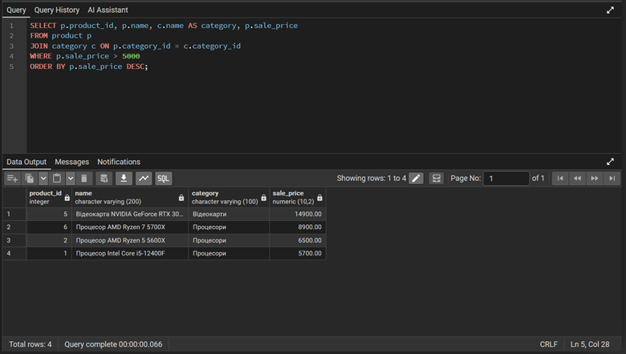
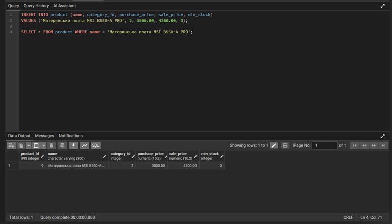
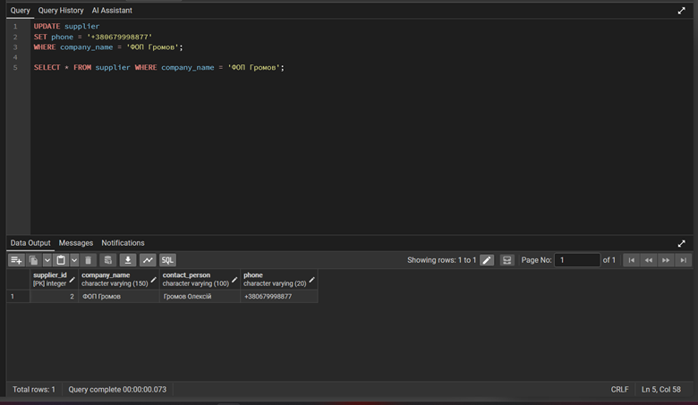
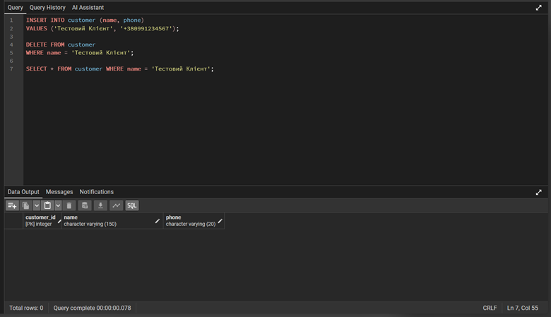

# Лабораторна робота 3: Маніпулювання даними SQL (OLTP)

**Дисципліна:** Організація баз даних

**Виконав:** студент групи ІО-46, Кучерук М.В. (Номер у списку: 05)

**Перевірив:** Русінов В.В.

---

## Цілі
* Написати запити `SELECT` для отримання даних (включаючи фільтрацію за допомогою `WHERE` та вибір певних стовпців).
* Практикувати використання операторів `INSERT` для додавання нових рядків до таблиць.
* Практикувати використання оператора `UPDATE` для зміни існуючих рядків (використовуючи `SET` та `WHERE`).
* Практикувати використання операторів `DELETE` для безпечного видалення рядків (за допомогою `WHERE`).
* Вивчити основні операції маніпулювання даними (DML) у PostgreSQL та спостерігати за їхнім впливом.

---

## 1. SQL-скрипт (OLTP транзакції)
Нижче наведено повний скрипт з усіма операторами маніпулювання даними (DML), які були успішно виконані в базі даних магазину електроніки. Скрипт імітує реальні бізнес-процеси: вибірку аналітики, додавання нових партій товару, зміну цін та списання, а також безпечне видалення помилкових записів.

```sql
-- =====================================================
-- 1. SELECT – отримання даних
-- =====================================================

SELECT p.product_id, p.name, c.name AS category, p.sale_price
FROM product p
JOIN category c ON p.category_id = c.category_id
WHERE p.sale_price > 5000
ORDER BY p.sale_price DESC;

SELECT s.supply_id, p.name AS product, sup.company_name AS supplier, w.name AS warehouse,
       s.quantity, s.supply_date, e.last_name || ' ' || e.first_name AS receiver
FROM supply s
JOIN product p ON s.product_id = p.product_id
JOIN supplier sup ON s.supplier_id = sup.supplier_id
JOIN warehouse w ON s.warehouse_id = w.warehouse_id
JOIN employee e ON s.employee_id = e.employee_id
WHERE s.supply_date BETWEEN '2026-03-01' AND '2026-03-31'
ORDER BY s.supply_date;

SELECT p.product_id, p.name, st.warehouse_id, st.quantity, p.min_stock
FROM stock st
JOIN product p ON st.product_id = p.product_id
WHERE st.quantity < p.min_stock;

SELECT p.product_id, p.name, SUM(sale.quantity) AS total_sold
FROM sale
JOIN product p ON sale.product_id = p.product_id
GROUP BY p.product_id, p.name
ORDER BY total_sold DESC
LIMIT 3;

SELECT c.customer_id, c.name, COUNT(s.sale_id) AS purchase_count
FROM customer c
JOIN sale s ON c.customer_id = s.customer_id
GROUP BY c.customer_id, c.name
HAVING COUNT(s.sale_id) > 1;

-- =====================================================
-- 2. INSERT – додавання нових даних
-- =====================================================

INSERT INTO supplier (company_name, contact_person, phone)
VALUES ('ФОП Мельник І.В.', 'Мельник Іван', '+380931112233');

SELECT * FROM supplier WHERE company_name = 'ФОП Мельник І.В.';


INSERT INTO product (name, category_id, purchase_price, sale_price, min_stock)
VALUES ('Материнська плата MSI B550-A PRO', 2, 3500.00, 4200.00, 3);

SELECT * FROM product WHERE name = 'Материнська плата MSI B550-A PRO';

INSERT INTO supply (product_id, quantity, supplier_id, warehouse_id, employee_id, supply_date)
VALUES (
    (SELECT product_id FROM product WHERE name = 'Материнська плата MSI B550-A PRO'),
    15,
    (SELECT supplier_id FROM supplier WHERE company_name = 'ФОП Мельник І.В.'),
    2,  
    3,  
    CURRENT_DATE
);

SELECT * FROM supply WHERE warehouse_id = 2 AND supply_date = CURRENT_DATE;

INSERT INTO stock (product_id, warehouse_id, quantity)
VALUES (
    (SELECT product_id FROM product WHERE name = 'Материнська плата MSI B550-A PRO'),
    2,
    15
);

SELECT * FROM stock WHERE product_id = (SELECT product_id FROM product WHERE name = 'Материнська плата MSI B550-A PRO');

INSERT INTO customer (name, phone) 
VALUES ('ТОВ ДатаЦентр', '+380445556677');

SELECT * FROM customer WHERE name = 'ТОВ ДатаЦентр';

INSERT INTO sale (product_id, quantity, warehouse_id, employee_id, customer_id, sale_date)
VALUES (
    (SELECT product_id FROM product WHERE name = 'Материнська плата MSI B550-A PRO'),
    5,
    2,
    3,
    (SELECT customer_id FROM customer WHERE name = 'ТОВ ДатаЦентр'),
    CURRENT_DATE
);

SELECT * FROM sale WHERE customer_id = (SELECT customer_id FROM customer WHERE name = 'ТОВ ДатаЦентр');

-- =====================================================
-- 3. UPDATE – зміна даних
-- =====================================================

UPDATE product
SET sale_price = sale_price * 1.05
WHERE category_id = (SELECT category_id FROM category WHERE name = 'Материнські плати');

SELECT product_id, name, sale_price FROM product WHERE category_id = 2;


UPDATE supplier
SET phone = '+380679998877'
WHERE company_name = 'ФОП Громов';

SELECT * FROM supplier WHERE company_name = 'ФОП Громов';

UPDATE stock
SET quantity = quantity - 2
WHERE product_id = 2 AND warehouse_id = 1;

SELECT * FROM stock WHERE product_id = 2 AND warehouse_id = 1;

UPDATE product
SET min_stock = 3
WHERE category_id = (SELECT category_id FROM category WHERE name = 'Відеокарти');

SELECT product_id, name, min_stock FROM product WHERE category_id = 4;

-- =====================================================
-- 4. DELETE – видалення даних
-- =====================================================

INSERT INTO product (name, category_id, purchase_price, sale_price, min_stock)
VALUES ('Тестовий кулер (помилка)', 1, 500.00, 700.00, 2);

DELETE FROM product WHERE name = 'Тестовий кулер (помилка)';

SELECT * FROM product WHERE name = 'Тестовий кулер (помилка)';

INSERT INTO supplier (company_name, contact_person, phone)
VALUES ('ТОВ Постачальник-Привид', 'Іван', '+380000000000');

DELETE FROM supplier WHERE company_name = 'ТОВ Постачальник-Привид';

SELECT * FROM supplier WHERE company_name = 'ТОВ Постачальник-Привид';

INSERT INTO customer (name, phone) 
VALUES ('Тестовий Клієнт', '+380991234567');

DELETE FROM customer WHERE name = 'Тестовий Клієнт';

SELECT * FROM customer WHERE name = 'Тестовий Клієнт';

```
## 2. Короткий письмовий звіт про виконання запитів

Відповідно до вимог завдання, нижче наведено опис кожного типу виконаних запитів, їх мета, очікуваний результат та статус:

* **Операції SELECT (Отримання даних):**
    * **Мета:** Отримати відфільтровані дані з кількох таблиць (товари дорожчі за 5000 грн, деталізовані надходження за березень, товари з критичним залишком), використовуючи оператори `JOIN`, `WHERE`, `GROUP BY` та `HAVING`.
    * **Очікуваний результат:** Виведення відповідних наборів даних, що відповідають умовам завдання.
    * **Статус:** Успішно. Запити повернули коректні результати без помилок синтаксису.
* **Операції INSERT (Додавання даних):**
    * **Мета:** Практика додавання нових зв'язаних сутностей до таблиць. Було створено нового постачальника, нову материнську плату, зафіксовано її надходження на склад, оновлено таблицю залишків та оформлено продаж новому клієнту.
    * **Очікуваний результат:** Поява нових записів у таблицях бази даних.
    * **Статус:** Успішно. Перевірочні `SELECT`-запити підтвердили наявність даних.
* **Операції UPDATE (Зміна даних):**
    * **Мета:** Модифікація існуючих даних із суворим використанням умови `WHERE` для обмеження впливу запиту. Було змінено ціни на певну категорію товарів, оновлено контактні дані та списано бракований товар зі складу.
    * **Очікуваний результат:** Зміна значень у конкретних стовпцях вибраних рядків.
    * **Статус:** Успішно. Усі зміни підтверджені.
* **Операції DELETE (Видалення даних):**
    * **Мета:** Практика безпечного видалення рядків за допомогою умови `WHERE`. Щоб уникнути порушення цілісності зовнішніх ключів (Foreign Key Constraints) на існуючих робочих даних, було створено спеціальні тестові записи, які потім успішно видалялися.
    * **Очікуваний результат:** Видалення тестових рядків з таблиць; наступний `SELECT` повертає порожній результат.
    * **Статус:** Успішно.

---

## 3. Докази виконання (Результати запитів)

Нижче наведено знімки екрана pgAdmin, що демонструють успішне виконання команд маніпулювання даними та доводять заповнення і зміну таблиць.

**Блок 1. SELECT-запит**
  

**Блок 2. INSERT-запит**
  

**Блок 3. UPDATE-запит**
  

**Блок 4. DELETE-запит**


---

## Висновок
Під час виконання лабораторної роботи було здобуто практичні навички роботи з DML-операціями (Data Manipulation Language) у СУБД PostgreSQL. Було успішно протестовано створену раніше схему бази даних за допомогою OLTP-транзакцій. Застосування `JOIN` та вкладених запитів дозволило ефективно маніпулювати пов'язаними даними, а використання умов `WHERE` в `UPDATE` та `DELETE` забезпечило безпечність операцій та збереження цілісності бази даних. Усі завдання виконані у повному обсязі.
