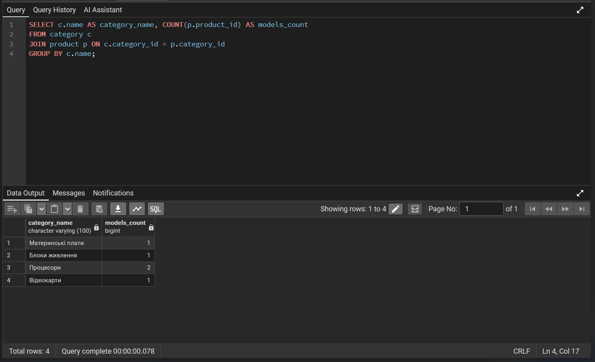
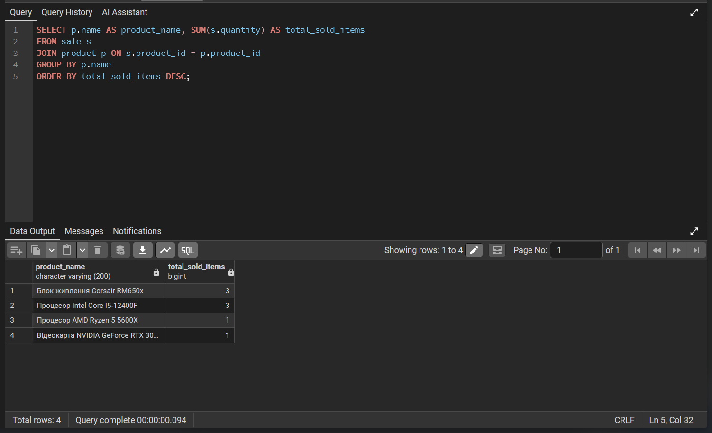
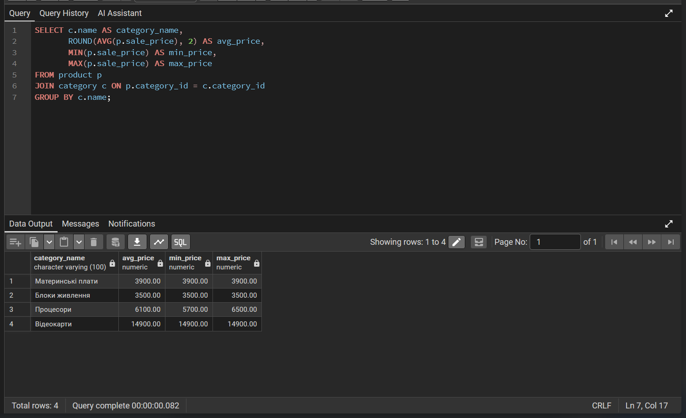
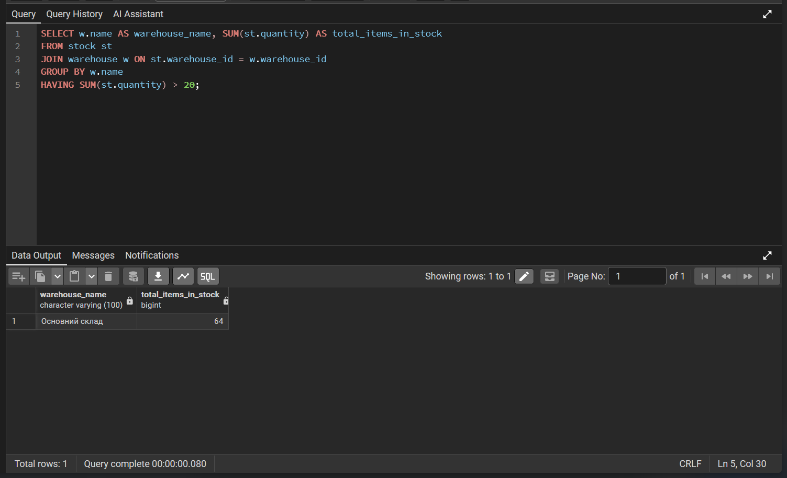
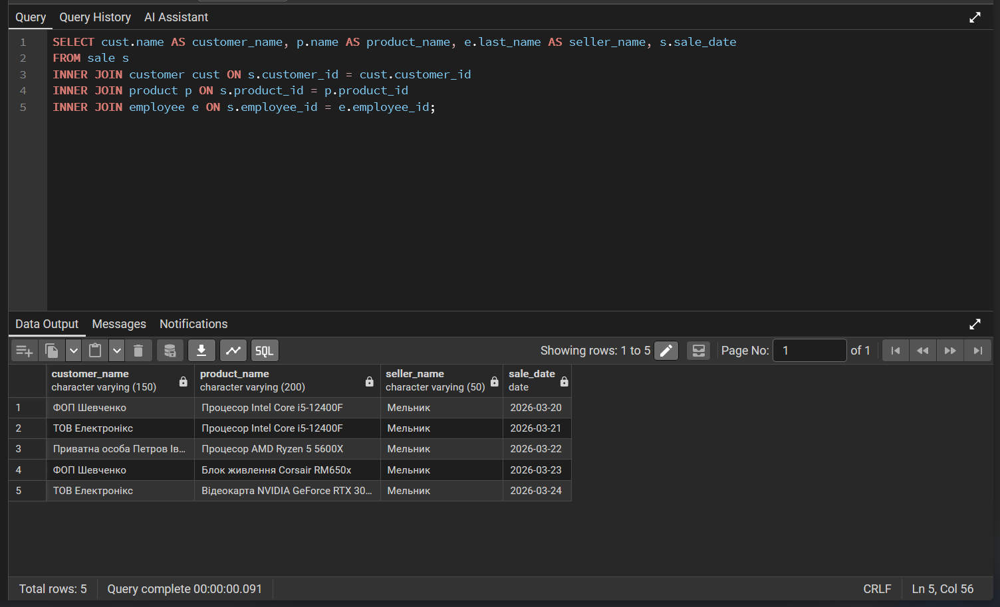
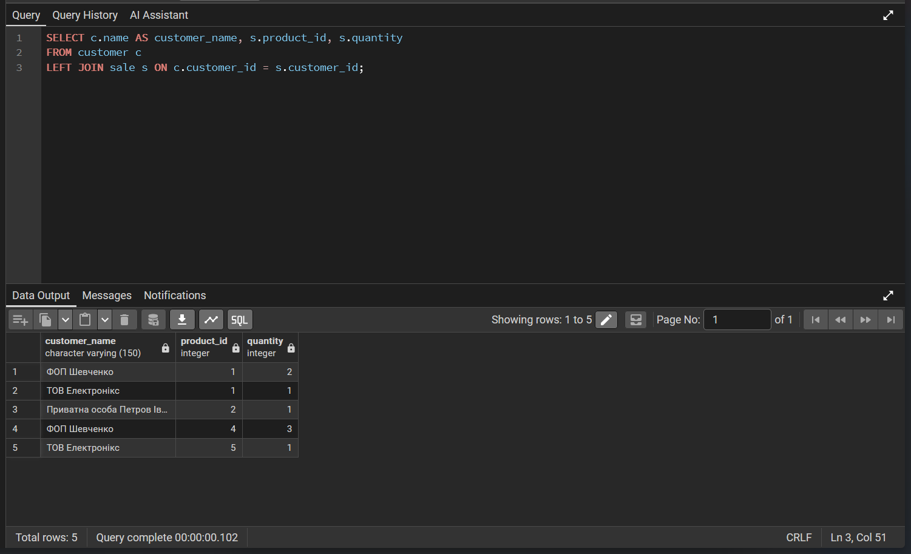
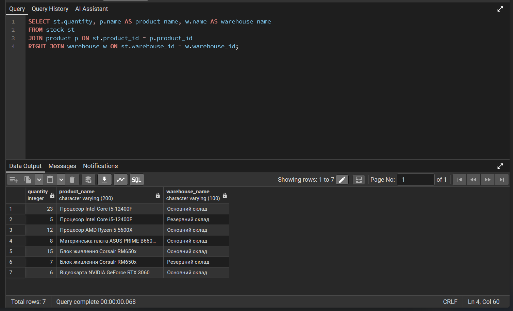
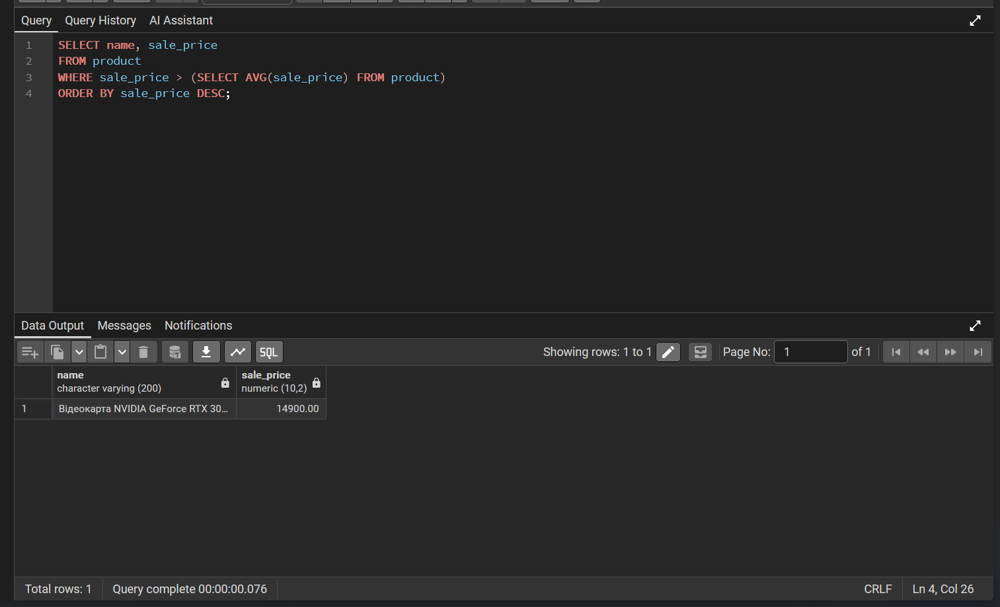
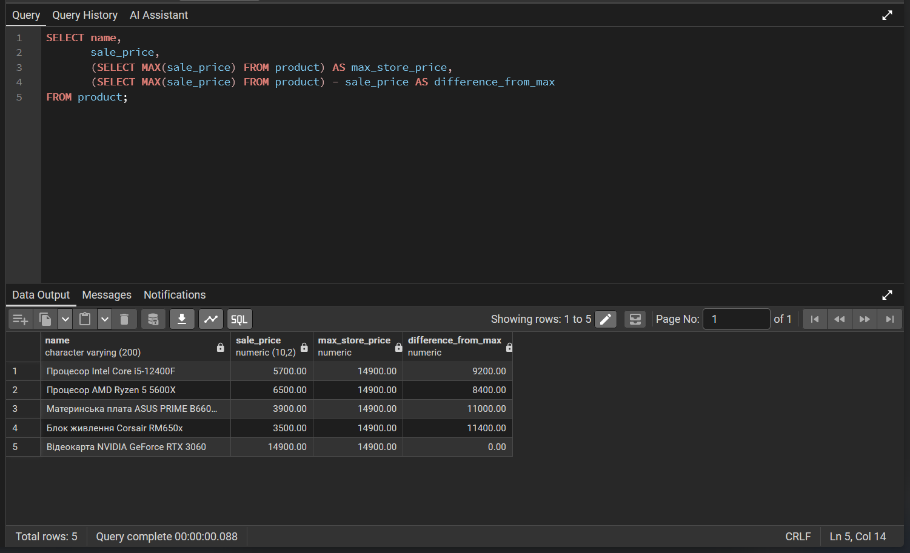
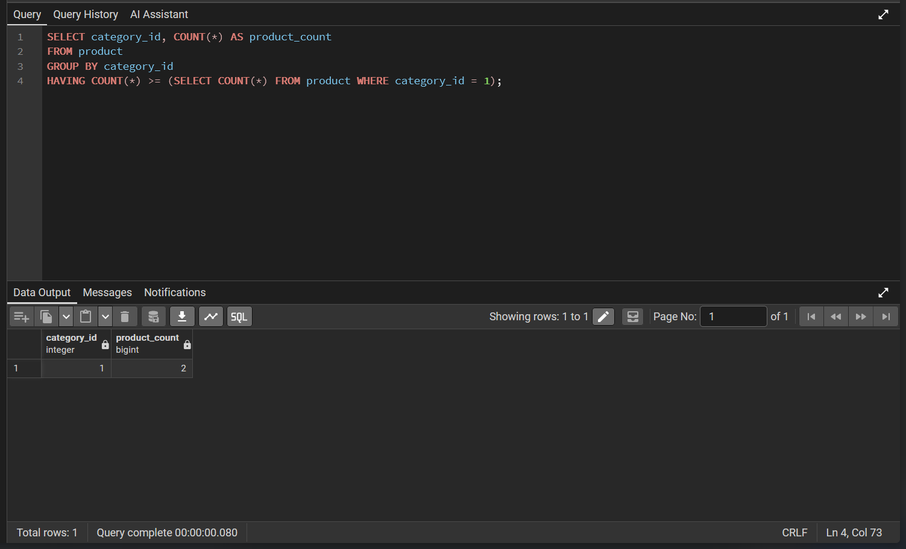

# Лабораторна робота 4: Аналітичні SQL-запити (OLAP)

**Дисципліна:** Організація баз даних

**Виконав:** студент групи ІО-46, Кучерук М.В. (Номер у списку: 05)

**Перевірив:** Русінов В.В.

---

## Цілі
* Використовувати агрегатні функції, такі як COUNT, SUM, AVG, MIN та MAX, для обчислення зведеної статистики з ваших даних.
* Написати запити GROUP BY для групування рядків за одним або кількома стовпцями та обчислення агрегатів для кожної групи.
* Використовувати HAVING для фільтрації результатів згрупованих запитів на основі агрегованих умов.
* Виконувати операції JOIN (принаймні INNER JOIN та LEFT JOIN), щоб об'єднати дані з кількох таблиць.
* Створювати об'єднані запити на агрегацію для кількох таблиць, які об'єднують таблиці та створюють згрупований, агрегований вивід.
* Інтерпретувати результати ваших запитів та пояснити, що робить кожен з них.

---

## 1. SQL-скрипт (OLAP запити)

Нижче наведено скрипт з аналітичними запитами, які були успішно виконані в базі даних магазину електроніки для отримання бізнес-аналітики.

```sql
-- ====================================================================
-- ЧАСТИНА 1: Базова агрегація та групування
-- ====================================================================

-- 1.1. COUNT та GROUP BY
SELECT c.name AS category_name, COUNT(p.product_id) AS models_count
FROM category c
JOIN product p ON c.category_id = p.category_id
GROUP BY c.name;

-- 1.2. SUM та GROUP BY
SELECT p.name AS product_name, SUM(s.quantity) AS total_sold_items
FROM sale s
JOIN product p ON s.product_id = p.product_id
GROUP BY p.name
ORDER BY total_sold_items DESC;

-- 1.3. AVG, MIN, MAX
SELECT c.name AS category_name, 
       ROUND(AVG(p.sale_price), 2) AS avg_price, 
       MIN(p.sale_price) AS min_price, 
       MAX(p.sale_price) AS max_price
FROM product p
JOIN category c ON p.category_id = c.category_id
GROUP BY c.name;

-- 1.4. HAVING
SELECT w.name AS warehouse_name, SUM(st.quantity) AS total_items_in_stock
FROM stock st
JOIN warehouse w ON st.warehouse_id = w.warehouse_id
GROUP BY w.name
HAVING SUM(st.quantity) > 20;

-- ====================================================================
-- ЧАСТИНА 2: Використання різних типів JOIN
-- ====================================================================

-- 2.1. INNER JOIN
SELECT cust.name AS customer_name, p.name AS product_name, e.last_name AS seller_name, s.sale_date
FROM sale s
INNER JOIN customer cust ON s.customer_id = cust.customer_id
INNER JOIN product p ON s.product_id = p.product_id
INNER JOIN employee e ON s.employee_id = e.employee_id;

-- 2.2. LEFT JOIN
SELECT c.name AS customer_name, s.product_id, s.quantity
FROM customer c
LEFT JOIN sale s ON c.customer_id = s.customer_id;

-- 2.3. RIGHT JOIN
SELECT st.quantity, p.name AS product_name, w.name AS warehouse_name
FROM stock st
JOIN product p ON st.product_id = p.product_id
RIGHT JOIN warehouse w ON st.warehouse_id = w.warehouse_id;

-- ====================================================================
-- ЧАСТИНА 3: Використання підзапитів
-- ====================================================================

-- 3.1. Підзапит у WHERE
SELECT name, sale_price
FROM product
WHERE sale_price > (SELECT AVG(sale_price) FROM product)
ORDER BY sale_price DESC;

-- 3.2. Підзапит у SELECT
SELECT name, 
       sale_price,
       (SELECT MAX(sale_price) FROM product) AS max_store_price,
       (SELECT MAX(sale_price) FROM product) - sale_price AS difference_from_max
FROM product;

-- 3.3. Підзапит у HAVING
SELECT category_id, COUNT(*) AS product_count
FROM product
GROUP BY category_id
HAVING COUNT(*) >= (SELECT COUNT(*) FROM product WHERE category_id = 1);

```
---

## 2. Опис виконання запитів

Відповідно до вимог, нижче наведено короткий опис кожного запиту: що він робить і чому.

**ЧАСТИНА 1: Агрегація та групування (4 запити)**
* **1.1:** Використовує `COUNT` та `GROUP BY` для підрахунку кількості моделей товарів у кожній категорії. Це дозволяє зрозуміти асортимент магазину.
* **1.2:** Використовує `SUM` для підрахунку загальної кількості проданих одиниць кожного товару. Допомагає виявити найпопулярніші позиції (бестселери).
* **1.3:** Застосовує `AVG`, `MIN`, `MAX` для аналізу цінової політики в розрізі категорій (середня, мінімальна та максимальна ціни товарів).
* **1.4:** Запит з `HAVING` фільтрує згруповані дані: показує лише ті склади, де загальний залишок товарів перевищує 20 одиниць.

**ЧАСТИНА 2: Використання JOIN (3 запити)**
* **2.1 (INNER JOIN):** Об'єднує 4 таблиці для виведення детальної інформації про кожен успішний продаж: ім'я клієнта, назву товару та прізвище менеджера-продавця.
* **2.2 (LEFT JOIN):** Виводить усіх клієнтів з бази та їхні покупки. Якщо клієнт ще нічого не купив, він все одно потрапляє у звіт (із значенням `NULL` у колонці покупок).
* **2.3 (RIGHT JOIN):** Об'єднує таблиці так, щоб показати всі існуючі склади, навіть якщо на них наразі немає жодного залишку товару.

**ЧАСТИНА 3: Підзапити (3 запити)**
* **3.1 (Підзапит у WHERE):** Динамічно знаходить середню ціну всіх товарів у магазині, а потім виводить лише ті товари, ціна яких вища за цю середню.
* **3.2 (Підзапит у SELECT):** Для кожного товару виводить його власну ціну, ціну найдорожчого товару в магазині загалом, та розраховує математичну різницю між ними.
* **3.3 (Підзапит у HAVING):** Знаходить категорії, в яких кількість товарів більша або дорівнює кількості товарів у конкретній категорії (з ID = 1). 

---

**Блок 1. Базова агрегація та групування**

*Запит 1.1: Підрахунок кількості моделей у категоріях (COUNT)*



*Запит 1.2: Підрахунок загальної кількості проданих товарів (SUM)*



*Запит 1.3: Аналіз цін по категоріях (AVG, MIN, MAX)*



*Запит 1.4: Склади із залишком більше 20 одиниць (HAVING)*



---

**Блок 2. Типи JOIN**

*Запит 2.1: Детальна інформація про продажі (INNER JOIN)*



*Запит 2.2: Усі клієнти та їхні покупки (LEFT JOIN)*



*Запит 2.3: Усі склади та їхні залишки (RIGHT JOIN)*



---

**Блок 3. Підзапити**

*Запит 3.1: Товари, дорожчі за середню ціну (Підзапит у WHERE)*



*Запит 3.2: Різниця в ціні з найдорожчим товаром (Підзапит у SELECT)*



*Запит 3.3: Категорії, де товарів не менше, ніж у категорії процесорів (Підзапит у HAVING)*


---

## Висновок
Під час виконання лабораторної роботи було здобуто практичні навички написання аналітичних SQL-запитів (OLAP). Було успішно застосовано агрегатні функції для зведення статистики, використано різні типи з'єднань (`INNER`, `LEFT`, `RIGHT JOIN`) для комплексного аналізу пов'язаних таблиць, а також реалізовано динамічну фільтрацію та обчислення за допомогою підзапитів. Запити дозволили витягти значущу бізнес-інформацію (статистику продажів, ціновий аналіз, активність клієнтів) з наявної бази даних.
