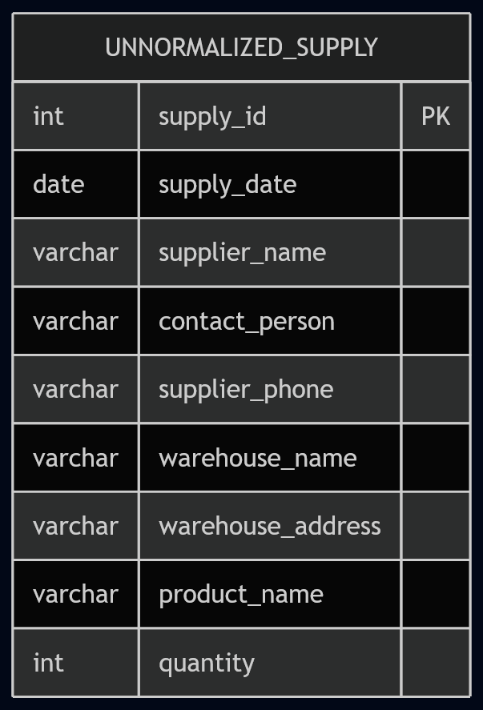
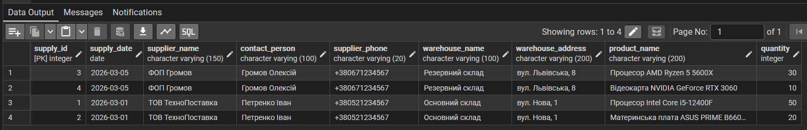
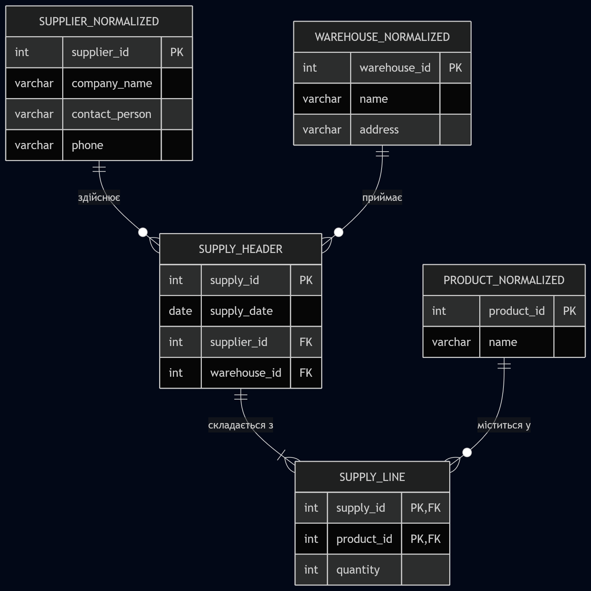
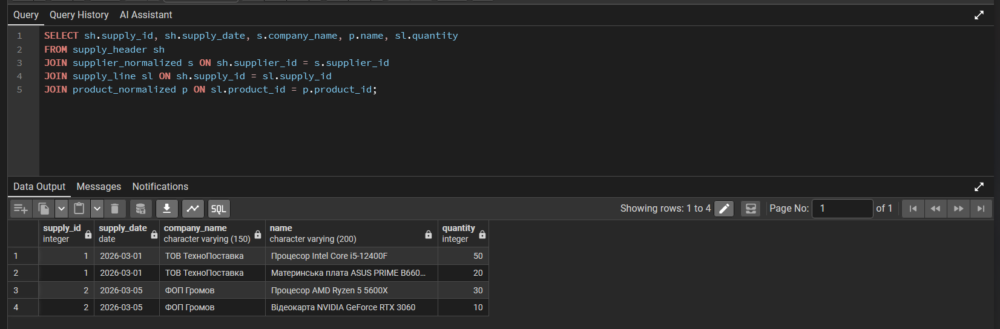

# Лабораторна робота № 5: Нормалізація бази даних

**Дисципліна:** Організація баз даних

**Виконав:** студент групи ІО-46, Кучерук М.В. (Номер у списку: 05)

**Перевірив:** Русінов В.В.

## Цілі
* Виявити потенційну надлишковість даних та аномалії (вставки, оновлення, видалення) у початковій ненормалізованій схемі.
* Визначити та перелічити функціональні залежності (ФЗ) для проблемних таблиць.
* Оцінити поточну нормальну форму і поетапно застосувати правила нормалізації для переведення структури у 1NF, 2NF та 3NF.
* Оновити SQL DDL-інструкції та згенерувати фінальну ER-діаграму нормалізованої бази даних.

## Хід роботи
Для проведення нормалізації було обрано підсистему обліку надходжень товарів на склад (Supply). Припустимо, що початково дані про поставки зберігалися у вигляді однієї "плоскої" таблиці `unnormalized_supply`, яка містила інформацію про саму поставку, постачальника, склад та перелік товарів в одному рядку.

Повний код для створення ненормалізованої таблиці, її нормалізації та заповнення тестовими даними знаходиться у файлі `normalization.sql` у цьому репозиторії.

### Етап 1. Аналіз початкової схеми (0NF)
Початкова таблиця `unnormalized_supply` має такі стовпці: `supply_id`, `supply_date`, `supplier_name`, `contact_person`, `supplier_phone`, `warehouse_name`, `warehouse_address`, `product_name`, `quantity`.

**Виявлені аномалії:**
* **Аномалія оновлення:** При зміні адреси складу або телефону постачальника необхідно оновлювати всі рядки, де вони згадуються.
* **Аномалія вставки:** Неможливо додати нового постачальника, поки він не зробить хоча б одну поставку (немає куди записати його дані).
* **Аномалія видалення:** При видаленні запису про єдину поставку конкретного постачальника, вся інформація про нього зникає з бази.

### Етап 2. Перехід до Першої нормальної форми (1NF)
Для досягнення 1NF ми позбулися повторюваних груп (списків товарів в одній поставці), рознісши кожен товар у новий рядок. Тепер первинним ключем стала комбінація `(supply_id, product_name)`. Атрибути стали атомарними.

**Функціональні залежності (ФЗ):**
1. `supply_id, product_name -> quantity` (Повна залежність).
2. `supply_id -> supply_date, supplier_name, contact_person, warehouse_name, warehouse_address` (Часткова залежність від частини ключа).
3. `supplier_name -> contact_person, supplier_phone` (Транзитивна залежність).
4. `warehouse_name -> warehouse_address` (Транзитивна залежність).

### Етап 3. Перехід до Другої нормальної форми (2NF)
Таблиця знаходиться в 1NF, але має часткові залежності. Для переходу до 2NF ми розбили її на дві:
* **`supply_header`** (Заголовок поставки): зберігає загальну інформацію (`supply_date`, дані постачальника та складу), яка залежить тільки від `supply_id`.
* **`supply_line`** (Деталі поставки): зберігає зв'язок `supply_id` + `product_name` та кількість товару.

### Етап 4. Перехід до Третьої нормальної форми (3NF)
Таблиця знаходиться в 2NF, але в `supply_header` залишилися транзитивні залежності. Для їх усунення ми винесли дані про постачальників та склади в окремі довідкові таблиці:
* Створено таблиці `supplier_normalized` та `warehouse_normalized`.
* У таблиці `supply_header` текстові дані замінено на зовнішні ключі `supplier_id` та `warehouse_id`.
* Інформацію про товари винесено в `product_normalized`, а в `supply_line` додано зовнішній ключ `product_id`.

## Результати виконання
Після виконання SQL-скриптів базу даних було успішно нормалізовано до 3NF. Усі надмірності та аномалії усунено.

Рисунок 1. ER-діаграма початкового стану (0NF). Демонструє "плоску" структуру зберігання даних з грубими порушеннями реляційної моделі.

Рисунок 2. Результат виконання запиту SELECT * FROM unnormalized_supply;. Наочно демонструє дублювання даних постачальників та складів при фіксації надходження кількох товарів.

Рисунок 3. Оновлена ER-діаграма після нормалізації (3NF). Відображає 5 нових нормалізованих таблиць зі встановленими зв'язками "один-до-багатьох" та правильними первинними й зовнішніми ключами.

Рисунок 4. Результат контрольної перевірки бази даних після нормалізації до 3NF. Використання оператора JOIN дозволяє реконструювати повну інформацію про поставки, об'єднуючи дані з окремих таблиць (supply_header, supplier_normalized, product_normalized та supply_line). Це підтверджує, що нова структура усунула надмірність: тепер кожен атрибут зберігається лише один раз, а зв’язки працюють коректно.

## Висновок
У ході виконання лабораторної роботи було проведено глибокий аналіз схеми бази даних та виявлено проблеми цілісності, спричинені надмірністю даних. На практиці було застосовано процес нормалізації: "плоску" ненормалізовану таблицю поставок було поетапно декомпозиовано, проходячи через першу (1NF) та другу (2NF) нормальні форми, до досягнення третьої нормальної форми (3NF). 

Було визначено функціональні залежності та усунено часткові й транзитивні залежності. В результаті ми отримали оптимальну реляційну структуру з 5 пов'язаних таблиць, що повністю усуває аномалії оновлення, вставки та видалення, а також забезпечує високу надійність та масштабованість бази даних PostgreSQL.