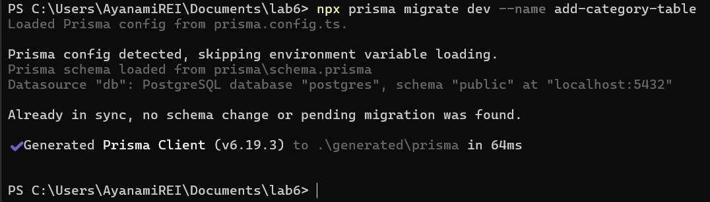
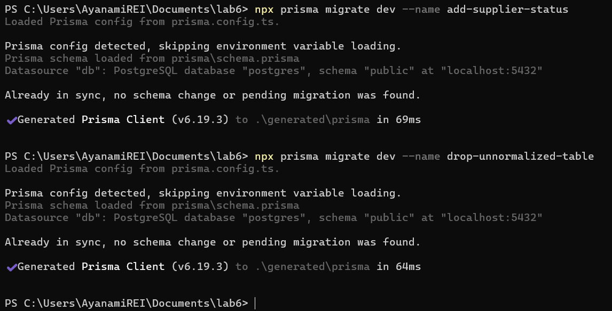
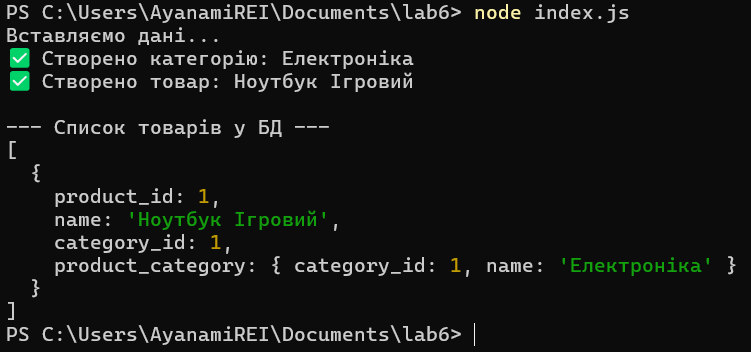
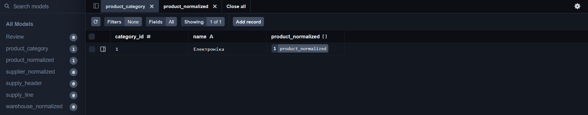
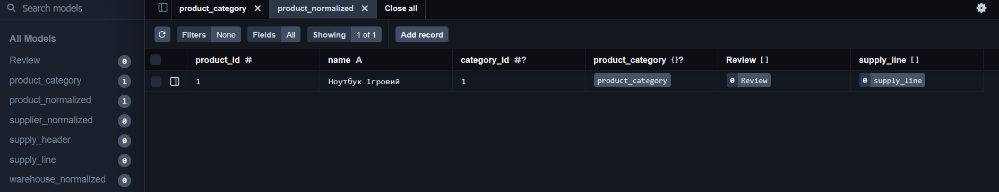

# Лабораторна робота № 6: Міграції схем за допомогою Prisma ORM

**Дисципліна:** Організація баз даних

**Виконав:** студент групи ІО-46, Кучерук М.В. (Номер у списку: 05)

**Перевірив:** Русінов В.В.

## Цілі
* Використати Prisma ORM для керування схемами та дослідити, як Prisma може аналізувати та змінювати схему вашої бази даних.
* Застосування міграцій - генерування та застосування змін схеми (таблиць, стовпців, зв'язків) за допомогою `prisma migrate`.
* Моделювання за допомогою файлів схеми Prisma - визначення таблиць та зв'язків у `schema.prisma` та перегляд їхнього відображення в PostgreSQL.
* Виконати базові запити Prisma - вставити та запитати дані за допомогою клієнта Prisma (через *Prisma Studio* або простий скрипт) для перевірки змін.

## 2. Хід роботи

Робота базується на реляційній схемі системи обліку поставок товарів, розробленій у попередніх лабораторних роботах. Процес управління структурою БД був переведений на декларативний підхід `Prisma`.

### 2.1. Ініціалізація та аналіз схеми

Проєкт був ініціалізований за допомогою `npm init` та встановлення пакетів prisma та `@prisma/client` версії 6. Після налаштування підключення у файлі `.env` було виконано команду `npx prisma db pull` для отримання структури існуючих таблиць у файл `schema.prisma`. Для синхронізації історії була створена базова міграція `init_db`.

### 2.2. Еволюція схеми (Міграції)

### Міграція 1: Додавання таблиці категорій (add-category-table)
Для систематизації товарів додано модель `product_category` та встановлено зв'язок "один-до-багатьох" з товарами.

### Фрагмент schema.prisma:
```prisma
model product_category {
  category_id        Int                  @id @default(autoincrement())
  name               String               @unique @db.VarChar(100)
  product_normalized product_normalized[]
}

model product_normalized {
  product_id         Int               @id @default(autoincrement())
  name               String            @unique @db.VarChar(200)
  category_id        Int?              
  product_category   product_category? @relation(fields: [category_id], references: [category_id])
}
```
### Міграція 2: Додавання статусу постачальника (add-supplier-status)
До таблиці `supplier_normalized` додано поле `is_active` для керування станом контрагентів.

### Фрагмент schema.prisma:
```prisma
model supplier_normalized {
  // ...
  is_active      Boolean         @default(true) 
}
```
### Міграція 3: Видалення застарілої таблиці (drop-unnormalized-table)
Після повної нормалізації даних таблиця `unnormalized_supply` була видалена зі схеми для оптимізації структури бази.

## 3. Результати виконання
Усі зміни були зафіксовані в окремих SQL-файлах міграцій та успішно застосовані до PostgreSQL.



Рисунок 1. Результат виконання команди `npx prisma migrate dev --name add-category-table`. Підтверджує успішне створення міграції та оновлення Prisma Client.



Рисунок 2. Застосування міграцій `add-supplier-status` та `drop-unnormalized-table`. Відображає послідовну зміну структури існуючих таблиць.

### 3.1. Перевірка через Prisma Client
Для верифікації зв'язків було використано скрипт `index.js`, який створює нову категорію та прив'язує до неї товар.

### Код скрипта `index.js`:

```javascript
const { PrismaClient } = require('@prisma/client');
const prisma = new PrismaClient();

async function main() {
    console.log("Вставляємо дані...");
    const newCategory = await prisma.product_category.create({
        data: { name: "Електроніка" }
    });
    console.log("✅ Створено категорію:", newCategory.name);

    const newProduct = await prisma.product_normalized.create({
        data: {
            name: "Ноутбук Ігровий",
            category_id: newCategory.category_id
        }
    });
    console.log("✅ Створено товар:", newProduct.name);

    console.log("\n--- Список товарів у БД ---");
    const products = await prisma.product_normalized.findMany({
        include: { product_category: true }
    });
    console.dir(products, { depth: null });
}

main().catch(console.error).finally(() => prisma.$disconnect());
```
Результат виконання (`node index.js`):



Рисунок 3. Вивід терміналу після запуску `node index.js`. Демонструє успішне вставлення даних та коректне отримання пов'язаних об'єктів (`Join`).

### 3.2. Візуальна перевірка в Prisma Studio
Фінальний стан даних перевірено за допомогою графічного інтерфейсу.



Рисунок 4. Перегляд моделі `product_category` у Prisma Studio. Відображає додану категорію "Електроніка".



Рисунок 5. Перегляд моделі `product_normalized` у Prisma Studio. Підтверджує зв'язок товару з категорією через `category_id`.

# 4. Висновок
У ході лабораторної роботи було опановано сучасний підхід до управління базами даних за допомогою **Prisma ORM**. Використання міграцій замість прямого написання SQL DDL-інструкцій дозволило автоматизувати процес оновлення схеми та забезпечити надійне версіонування структури проєкту. Практичне використання **Prisma Client** підтвердило переваги типізованого доступу до даних, що значно спрощує розробку та мінімізує помилки при роботі зі складними реляційними зв'язками.
